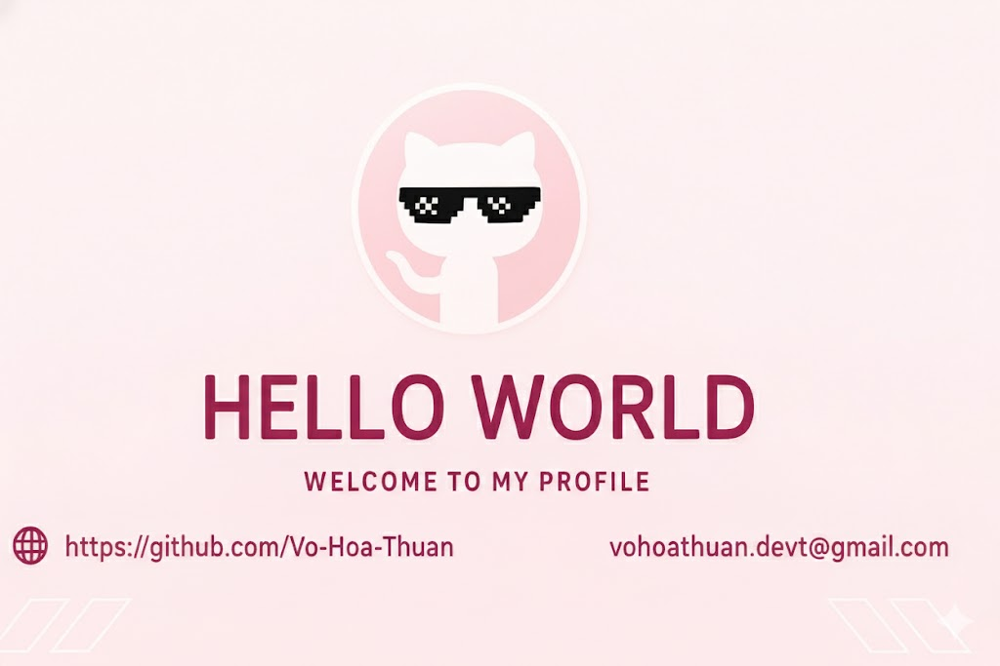

<!--Banner-->

<!--Night Owl image-->

  

<!--Header Name-->
#  ɪ'ᴍ VoHoaThuan - DT!  
*FullStack Developer / Programmer*
  

<!--Start Intro-->               

  A passionate Full Stack Developer focusing on Node.js, Express, and Front-end development with React.

- ✨ Always learning and exploring new technologies  
- 🌱 Currently improving skills in TypeScript & Cloud Deployment  
- 💬 Ask me about JavaScript, Node.js, and RESTful APIs  
- 🚀 I love building tools that simplify daily workflows  
- 💻 Visit my [Portfolio](https://profile-dev-five.vercel.app/) for more about me  
- 📫 Reach me at **vohoathuan.devt@gmail.com**

<!--End Intro-->

<!--Profile Count Badge-->

  

---

<!--Languages and Tools Section-->       
<h2 align="center">⚙️ Tech Stack & Skills</h2> 
<picture>
  <source media="(prefers-color-scheme: dark)" srcset="./Skills_Animation_Dark.gif">
  <source media="(prefers-color-scheme: light)" srcset="./Skills_Animation_White.gif">
  
</picture>

 

### 🧠 Current Learning
- Deepening knowledge in AI & Backend optimization  
- Exploring modern React patterns and API integration  
- Practicing deployment with Vercel and Docker  

---

<!--Trophies Section-->   
<h2 align="center">🏆 GitHub Trophies 🏆</h2>

  <picture>
    <source media="(prefers-color-scheme: dark)" srcset="https://github-profile-trophy.vercel.app/?username=Vo-Hoa-Thuan&no-bg=true&row=2&column=6&theme=radical">
    <source media="(prefers-color-scheme: light)" srcset="https://github-profile-trophy.vercel.app/?username=Vo-Hoa-Thuan&no-bg=true&row=2&column=6">
    
  </picture>

---

<!--Github stats Table--> 
<h2 align="center">📊 GitHub Stats</h2>

<table width="100%">
  <tr>
    <td width="50%">
      <h3 align="center"><strong>Statistics</strong></h3>
      

        
      

    </td>
    <td width="50%">
      <h3 align="center"><strong>Streak</strong></h3>
      

        
      

    </td>
  </tr>
</table>

---

<!--Contribution Graph-->
<h2 align="center">📈 Contribution Graph</h2>

  

---

<!--Dynamic Quote card-->
<h2 align="center">🌟 Thought of the Day 🌟</h2>

  

---

<h2 align="center">🤝 Cᴏɴɴᴇᴄᴛ Wɪᴛʜ Mᴇ 🤝 </h2>

  

<!-- 

  -->

<!-- Buy me a coffee

 -->

<!--Footer--> 

  

